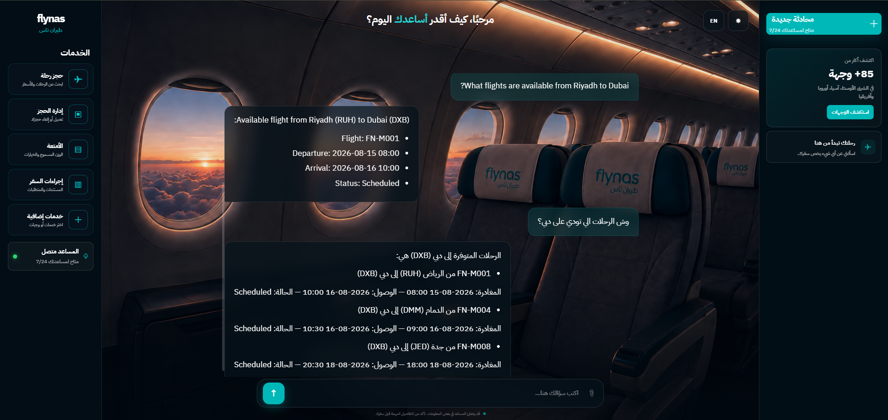
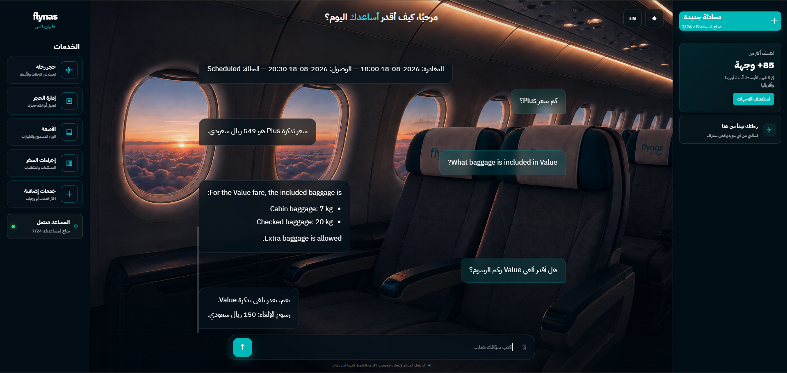
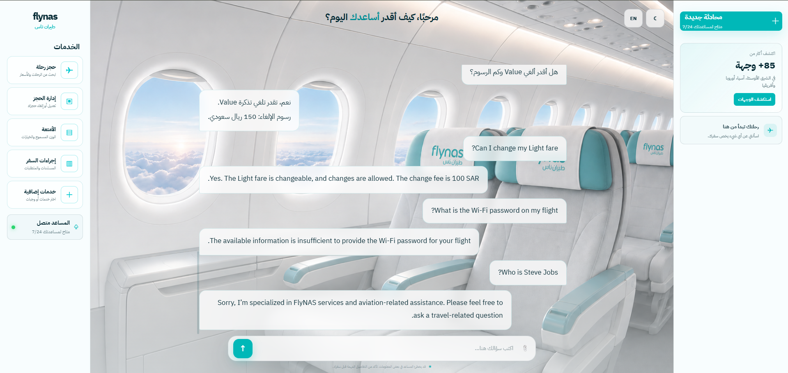

# ✈️ FlyNAS AI Travel Assistant


An AI-powered travel assistant MVP developed as a personal project during my internship at FlyNAS.


The assistant helps users with flight search, fares, baggage policies, booking policies, and general travel-related questions in both Arabic and English.


The project combines structured SQL data, intelligent question routing, Retrieval-Augmented Generation (RAG), vector similarity search, and OpenAI to generate relevant responses.


> **Note:** This is a personal MVP/prototype project using mock/test data. It is not connected to FlyNAS production systems.


---


## 📸 Demo


### Flight Search





### Fare & Baggage Questions





### Arabic & English Support





---


## 🚀 Features


- 🤖 AI-powered conversational assistant
- 🌐 Arabic and English support
- ✈️ Flight search by origin and destination
- 🏙️ Arabic and English city detection
- 🛫 Airport code detection
- 💰 Fare price lookup
- ⚖️ Fare comparison
- 🧳 Baggage policy lookup
- 🎫 Booking and cancellation policy lookup
- 🧭 Intelligent question routing
- 📚 Retrieval-Augmented Generation (RAG)
- 🔎 Embedding-based vector similarity search
- 🗄️ SQLite database for structured data
- ⚡ FastAPI backend
- 💻 React frontend
- 📖 Swagger API documentation
- 🛡️ Basic error and edge-case handling


---


## 🧠 How It Works


The system first analyzes the user's question and routes it to the appropriate service.


```text
                         User Question
                              │
                              ▼
                       React Frontend
                              │
                              ▼
                       FastAPI Backend
                              │
                              ▼
                      Question Router
                              │
             ┌────────────────┴────────────────┐
             │                                 │
             ▼                                 ▼
       Structured Data                       RAG
             │                                 │
      ┌──────┼──────┐                          ▼
      │      │      │                     Knowledge Base
      ▼      ▼      ▼                          │
   Flights  Fares  Policies                   ▼
      │      │      │                     Text Chunks
      └──────┴──────┘                          │
             │                                 ▼
             ▼                         OpenAI Embeddings
           SQLite                            │
                                             ▼
                                      Vector Similarity
                                             │
                                             ▼
                                       Best Context
                                             │
             └────────────────┬────────────────┘
                              ▼
                         OpenAI GPT-5.5
                              │
                              ▼
                       Final Response
🗄️ Structured Data

Structured travel information is stored in SQLite and accessed through dedicated services.

The database includes information such as:

Airports
Flights
Fare types
Baggage policies
Booking policies

The assistant uses SQL-based services when the user's question requires structured information.

Examples:

What flights are available from Riyadh to Dubai?


How much is the Plus fare?


What baggage is included in Value?


Can I cancel my Value fare?
📚 Retrieval-Augmented Generation (RAG)

For general knowledge-base questions, the assistant uses a simple RAG pipeline.

Knowledge Base
      │
      ▼
Split into Chunks
      │
      ▼
Create Embeddings
      │
      ▼
Vector Store
      │
      ▼
User Question
      │
      ▼
Question Embedding
      │
      ▼
Cosine Similarity
      │
      ▼
Most Relevant Chunk
      │
      ▼
OpenAI GPT-5.5
      │
      ▼
Final Answer

The project uses:

text-embedding-3-small for embeddings
NumPy for cosine similarity
An in-memory vector store
OpenAI GPT-5.5 for response generation
🧭 Intelligent Question Routing

The router determines how each question should be handled.

Current routes include:

rag
flight_sql
baggage_sql
booking_sql
fare_comparison
fare_sql

Examples:

User Question	Route
What flights are available from Riyadh to Dubai?	Flight SQL
وش الرحلات الي تودي على دبي؟	Flight SQL
What baggage is included in Value?	Baggage SQL
Can I cancel my Value fare?	Booking SQL
Compare Light, Value, and Plus	Fare Comparison
What is FlyNAS?	RAG
Can I add baggage to my booking?	RAG
💬 Example Questions
✈️ Flight Search

English

What flights are available from Riyadh to Dubai?

The assistant can identify:

Origin city
Destination city
Airport codes
Available flights
Departure time
Arrival time
Flight status

Arabic

وش الرحلات الي تودي على دبي؟

The assistant can return all available flights to Dubai.

💰 Fare Information

كم سعر Plus؟

The assistant retrieves the Plus fare price from the database.

🧳 Baggage

What baggage is included in Value?

The assistant returns:

Cabin baggage allowance
Checked baggage allowance
Extra baggage availability
🎫 Booking Policy

هل أقدر ألغي Value وكم الرسوم؟

The assistant returns the cancellation policy and applicable fee.

⚖️ Fare Comparison

Compare Light, Value, and Plus.

The assistant compares:

Price
Cabin baggage
Checked baggage
Change policy
Cancellation policy
Change fees
Cancellation fees
Refundability
❓ Missing Information

What is the cancellation fee?

Instead of assuming a fare, the assistant asks the user to specify one:

Which fare would you like to check: Light, Value, or Plus?

🚫 Unsupported Fare

What is the cancellation fee for Premium?

The assistant detects that Premium is not one of the supported fares and responds accordingly.

Supported fares:

Light
Value
Plus
🌐 Out-of-Scope Question

Who is Steve Jobs?

The assistant identifies that the question is outside its intended scope and redirects the user toward FlyNAS and travel-related questions.

🛡️ Error & Edge-Case Handling

The system handles several common edge cases:

Missing destination
Missing fare
Unsupported fare
No flights found
Unsupported questions
Arabic and English variations
Incomplete travel questions

Example:

User:
What flights are available from Riyadh?


Assistant:
What destination would you like to fly to?

The assistant avoids assuming missing information when it can ask the user for clarification.

🛠️ Tech Stack
Backend
Python
FastAPI
Uvicorn
Pydantic
SQLite
Python-dotenv
AI
OpenAI API
GPT-5.5
Retrieval-Augmented Generation (RAG)
OpenAI Embeddings
text-embedding-3-small
Cosine Similarity
Frontend
React
Vite
JavaScript
CSS
Development
Git
GitHub
VS Code
📁 Project Structure
flynas-ai-assistant/
│
├── backend/
│   ├── data/
│   │   └── flynas_faq.txt
│   │
│   ├── database/
│   │   ├── database.py
│   │   └── seed.py
│   │
│   ├── services/
│   │   ├── ai_service.py
│   │   ├── airport_service.py
│   │   ├── baggage_service.py
│   │   ├── booking_service.py
│   │   ├── embedding_service.py
│   │   ├── fare_service.py
│   │   ├── flight_service.py
│   │   ├── knowledge_service.py
│   │   ├── router_service.py
│   │   ├── similarity_service.py
│   │   └── vector_store.py
│   │
│   ├── main.py
│   └── prompts.py
│
├── frontend/
│   ├── public/
│   └── src/
│
├── docs/
│   └── screenshots/
│
├── requirements.txt
├── .gitignore
├── FlyNAS_AI_Travel_Assistant.pptx
└── README.md

The current repository contains separate backend services for AI responses, airport detection, baggage, booking, fares, flights, embeddings, knowledge retrieval, routing, similarity search, and the vector store.

🔌 API Endpoints
Method	Endpoint	Description
GET	/	Welcome message
GET	/health	Health check
GET	/about	Project information
POST	/chat	Send a question to the assistant
Swagger UI
http://127.0.0.1:8000/docs
🔐 Environment Variables

Create a .env file inside the backend directory:

OPENAI_API_KEY=your_api_key_here

Never commit API keys or .env files to GitHub.

▶️ Running the Backend

Navigate to the backend:

cd backend

Create and activate a virtual environment:

python -m venv venv
.\venv\Scripts\Activate.ps1

Install dependencies:

pip install -r ../requirements.txt

Initialize the database:

python database\database.py

Seed the database:

python database\seed.py

Run the FastAPI server:

uvicorn main:app --reload

The backend will run at:

http://127.0.0.1:8000

Swagger documentation:

http://127.0.0.1:8000/docs
▶️ Running the Frontend

Open another terminal:

cd frontend

Install dependencies:

npm install

Run the development server:

npm run dev

The frontend will normally be available at:

http://localhost:5173
🧪 Testing

The assistant has been tested with:

Existing flight routes
Non-existing flight routes
Flights to a destination
Missing destinations
Arabic flight questions
English flight questions
Supported fares
Unsupported fares
Fare comparison
Fare prices
Baggage questions
Booking policies
Cancellation policies
RAG questions
Out-of-scope questions
📊 Project Status
MVP — Completed ✅

The current MVP includes:

FastAPI backend
React frontend
OpenAI integration
SQLite database
Flight search
Fare lookup
Fare comparison
Baggage policies
Booking and cancellation policies
Airport and city detection
Arabic and English support
Intelligent question routing
RAG
Embeddings
Vector similarity search
Error handling
Edge-case testing
Swagger API documentation
Future Improvements
Real-time flight data
Real FlyNAS API integration
Flight booking
Reservation management
Flight status tracking
Online check-in assistance
Authentication
Conversation memory
Production deployment
Monitoring and analytics
⚠️ Limitations

This project is an MVP/prototype and has several limitations:

Uses mock/test travel data
Not connected to FlyNAS production systems
Flight information is not real-time
Booking and reservation actions are not implemented
The vector store is currently in memory
Authentication is not implemented
Production deployment is not included
📊 Project Presentation

The project presentation is included in the repository:

View the Project Presentation

🎯 Project Vision

The long-term vision is to build a complete AI-powered travel assistant that can support passengers throughout their travel journey.

Potential future capabilities include:

Flight search and booking
Reservation management
Flight status tracking
Check-in assistance
Travel requirements
Personalized travel recommendations
Multi-language support
Conversation memory
👨‍💻 Author

Ibrahim AlFayez

Personal AI project developed during my internship at FlyNAS.